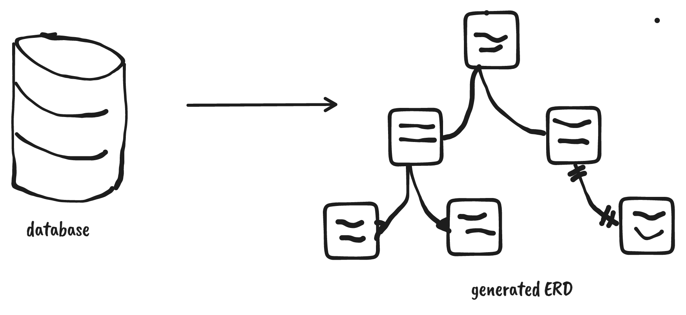

## <h1><b>Schema to ERD</b></h1>

Hi good people of the internet, am happy to announce to you one of my newest tool that will help in reducing the time required to onboard new backend developers to your teams especially if you don't have well documented ERDs for your databases. This tool also helps in removing the need to do manual updates to your existing ERDs ( which is tiring especially if you are working in an environment where these changes can be many within a short span of time ), just point the tool to your database and it should be able to generate a pictorial view of your current database ( including relationships and such ). 

## <b>Usage</b>
### <u><i>with .env files</i></u>

sample .env
```bash
DB_USER = <database username>
DB_HOST = <database host url>
DB_NAME = <database name>
DB_PASS = <databse password>
DB_DIALECT = <database dialect> # 'postgres', 'mysql', 'mssql', 'sqlite', 'mariadb', 'db2', 'snowflake', 'oracle'
DB_PORT = <database port>
```
execution
```bash
$ happy-ste # when asked whether to use a .env file just enter ( Y / Yes / yes  )
```

### <u><i>interactively</i></u>

place a gif here i think

> In both running from a .env or interactively we generate a .plantuml file that is saved in your current directory. This generated file can be used later with to generate the svg schemas if need be

### <u><i>from generated .plantuml files</i></u>
```bash
$ happy-ste <path to your generated .plantuml file>
```


